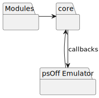

# Overview

All communication goes through the core library. The callbacks to the emulator are set during startup, before loading and setting up the target library.

Modules should only communicate unidirectional with the core library. Everything that can't be done locally inside modules, goes here.