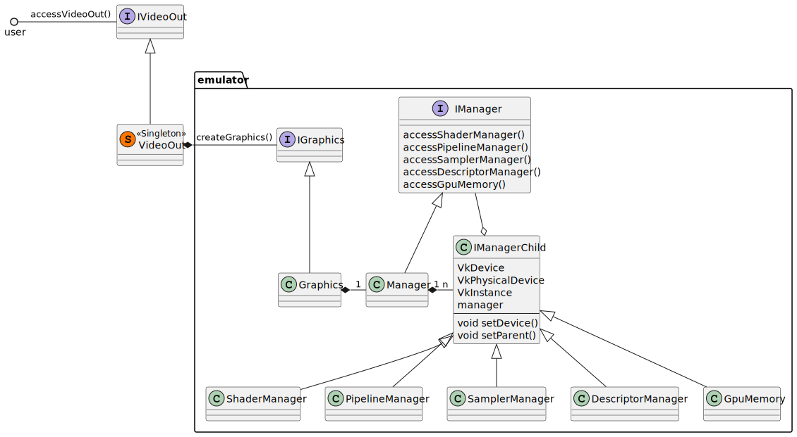
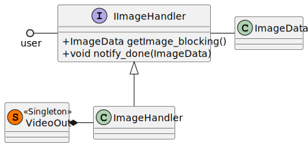

## Video out

* Manages the display buffers used in Linux/PlayStation.
* Setup of  Vulkan (GPU detection etc.)
* Emits Kernel events: flip, vblank

### Swapchain image handling

User calls getImage_blocking() to retrieve the display image. After present notify_done() is called.

getImage_blocking() releases users FIFO. The whole swapchain images are handled by ImageHandler

